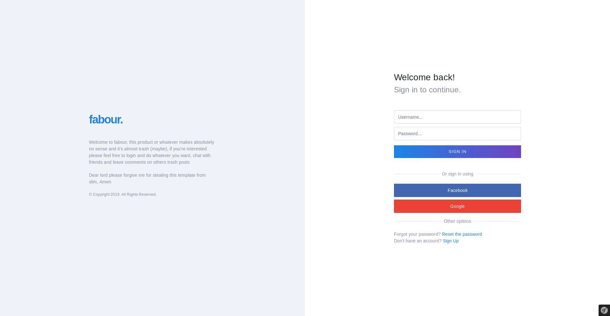
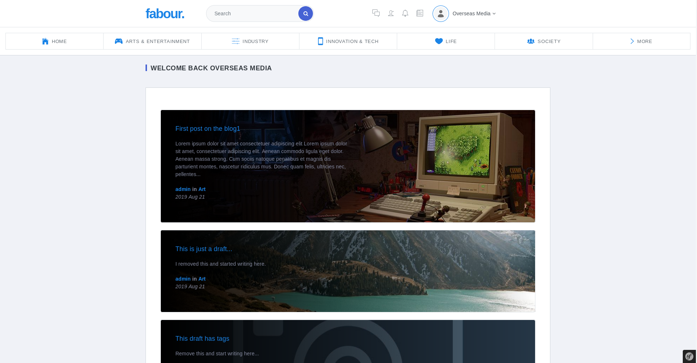
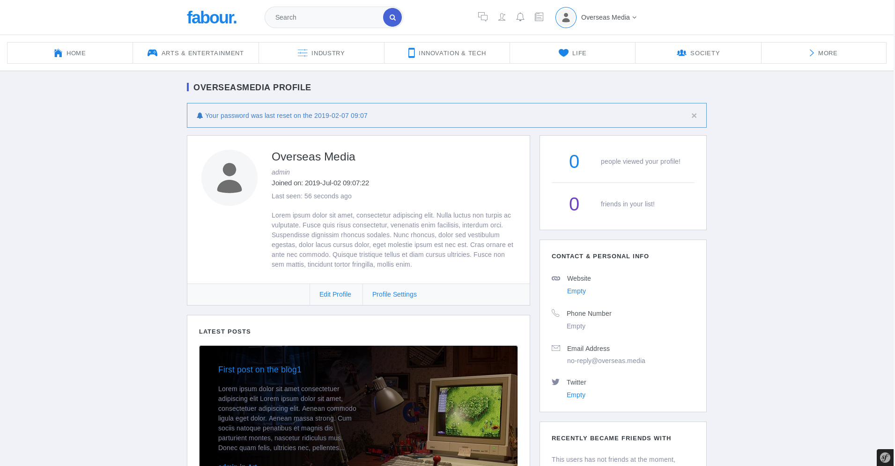
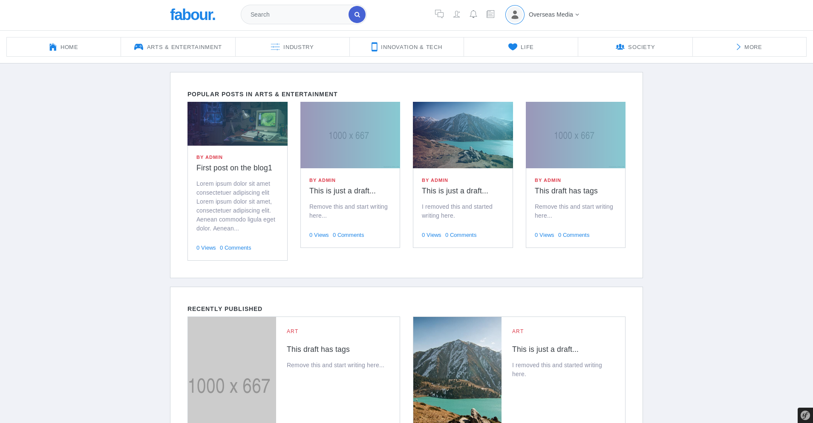

# Fabour: Personal Symfony 4 Project

### This projects started off as a websockets playgoround, i was just trying to understand how everything works, everntually i found myself working on kind of a larger project with more structure.

## This project contains:
+ GosWebSockets (Which uses Ratchet)
+ AMQP (Sending messages)
+ Vuejs (Reactive parts of the application)
+ TinyMCE (editor)
+ Imagine (Images manipulation)
+ UUidEncode (HashIds)

### Login page

### Home page

### Profile page

### Category page

#### TODO: add the conversation and chatting screenshots.